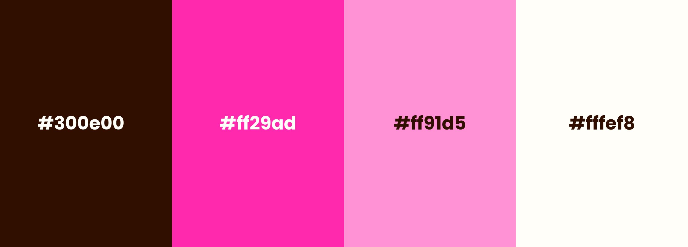
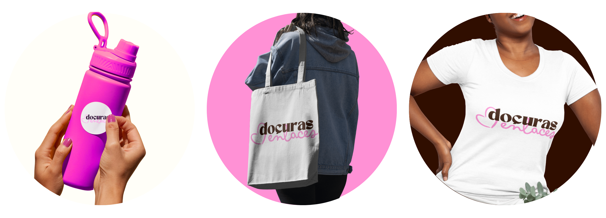
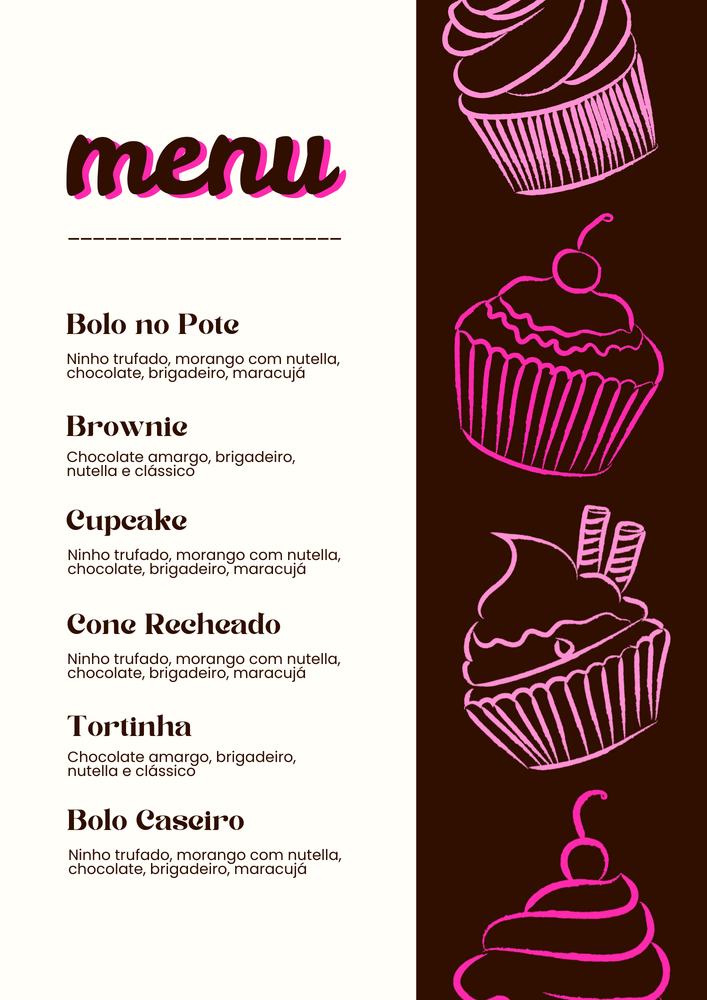
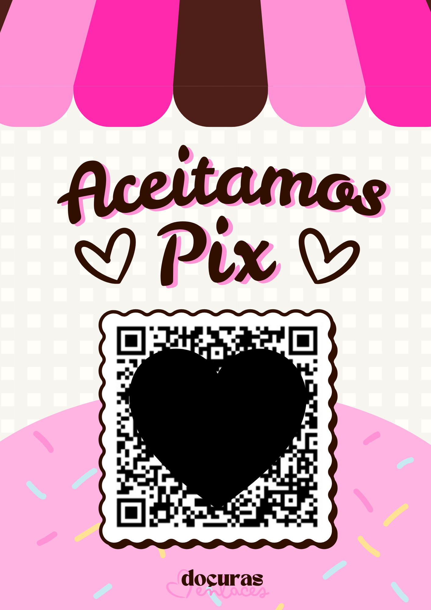

# `💗 Docuras Enlaces — Identidade Visual`

> **Docuras Enlaces** é uma marca de confeitaria criada para uma loja física real em fase de inauguração. Sua identidade visual traduz afeto, delicadeza e conexão emocional, unindo o universo dos doces à ideia de vínculos, memórias e momentos compartilhados.

---

## `💡 Conceito da Marca`

A identidade visual da **Docuras Enlaces** nasce do conceito de **conexão através da doçura**.  
Mais do que vender doces, a marca propõe criar **laços emocionais** — entre pessoas, momentos e experiências.

O nome “Enlaces” simboliza:
- União  
- Afeto  
- Compartilhamento  
- Memórias afetivas  

Visualmente, a marca aposta em uma estética:
- Delicada  
- Acolhedora  
- Feminina e contemporânea  

Toda a construção visual foi pensada para transmitir conforto, proximidade e carinho, sem perder sofisticação.

---

## `🎨 Paleta de Cores`

Cores principais:
- **Marrom (#300e00)** — remete ao chocolate, à tradição e à sofisticação  
- **Rosa vibrante (#ff29ad)** — representa alegria, doçura e destaque visual  
- **Rosa claro (#ff91d5)** — reforça delicadeza, afeto e suavidade  
- **Off-white (#fffef8)** — equilíbrio, leveza e neutralidade  

A paleta foi desenvolvida para garantir harmonia, contraste e boa legibilidade em diferentes aplicações.

---

## `🔤 Identidade Visual`

A identidade visual foi construída para ser **emocionalmente envolvente e versátil**, mantendo coerência em todos os pontos de contato da marca.

Elementos principais:
- Logotipo tipográfico com contraste entre tipografia sólida e fluida  
- Elemento gráfico em forma de coração, simbolizando os “enlaces”  
- Uso equilibrado das cores em fundos claros e escuros  
- Estética acolhedora, pensada para materiais físicos e digitais  

---

## `🛠️ Processo Criativo`

O desenvolvimento da marca seguiu um processo estratégico de branding:

1. Briefing com foco no posicionamento da loja física  
2. Pesquisa de referências no segmento de confeitaria artesanal  
3. Definição do conceito emocional da marca  
4. Desenvolvimento do logotipo e identidade visual  
5. Criação da paleta cromática  
6. Aplicação da marca em mockups e materiais gráficos  

Cada decisão visual foi pensada para alinhar estética, propósito e experiência do cliente.

---

## `🖼️ Logotipo Principal`

---

## `📦 Mockups e Aplicações`

## `📑 Arquivos adicionais do projeto`

  
  &nbsp;&nbsp;
  

---

## 👤 Autoria

Identidade visual desenvolvida por **Julia Franco**  
Designer Digital  
Projeto comercial — desenvolvido sob encomenda
