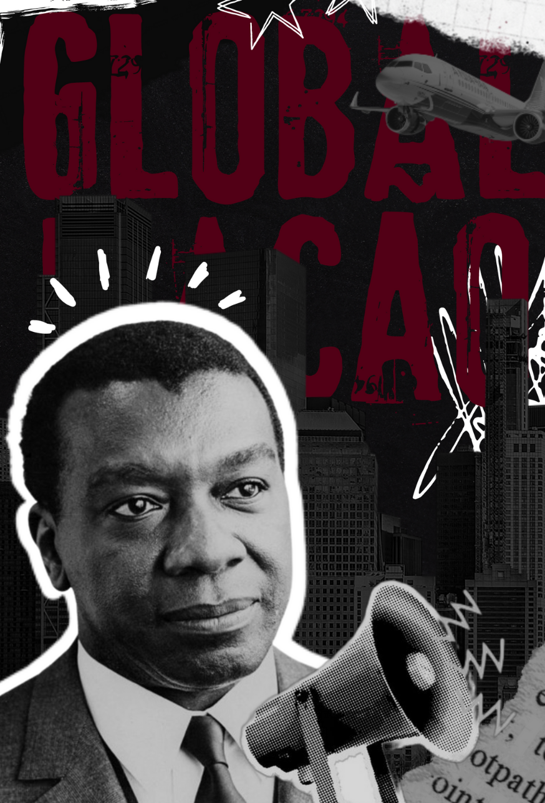
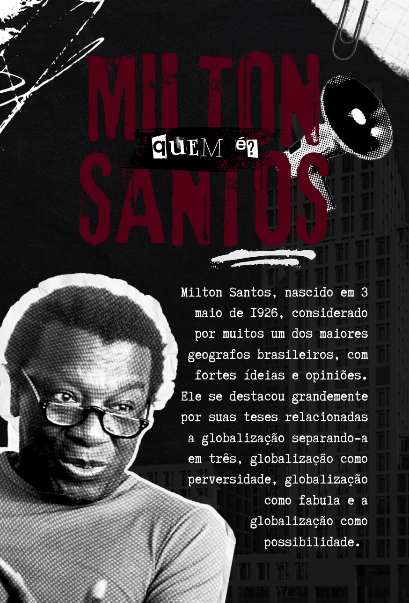
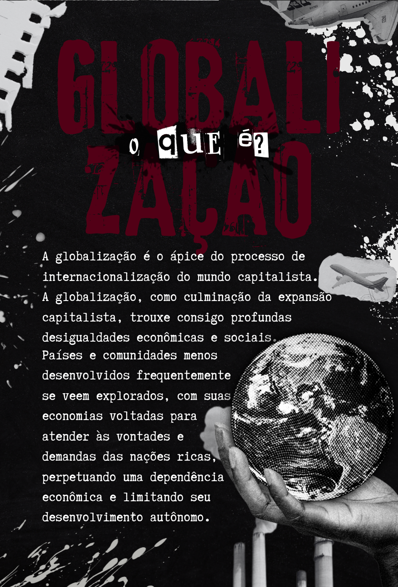
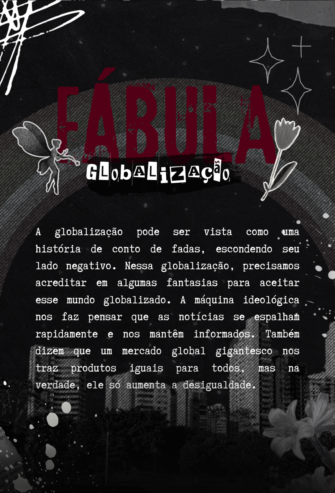
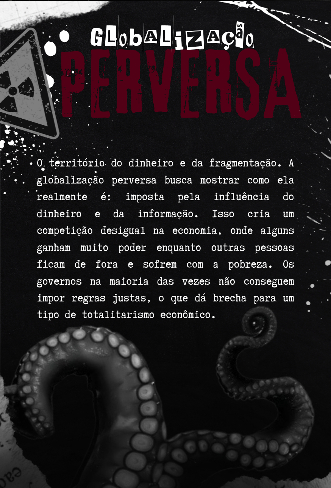
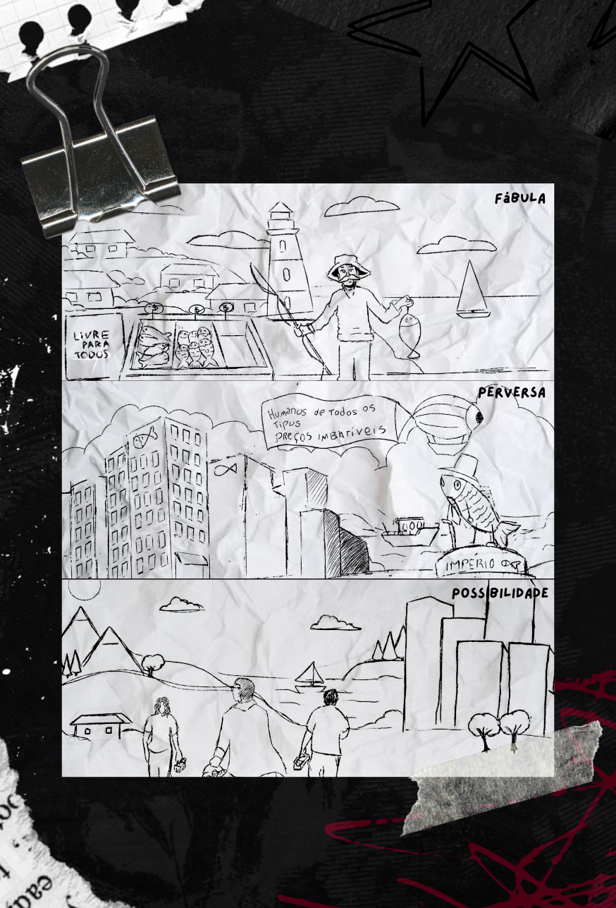
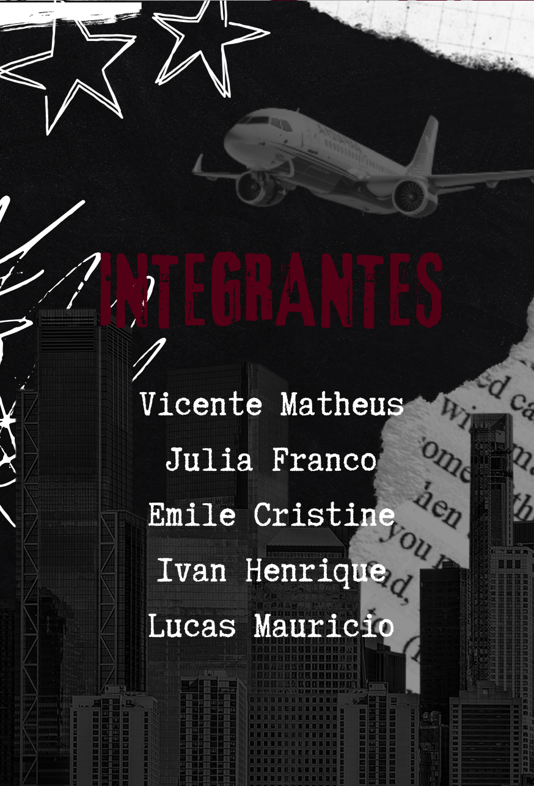

# `🌍 Globalização por Milton Santos - Fanzine`

> O projeto **Globalização por Milton Santos** é um fanzine acadêmico desenvolvido para a disciplina de Geografia. A proposta visual utiliza a estética de colagem e a rebeldia do movimento **Punk** para traduzir os conceitos críticos do geógrafo brasileiro sobre as perversidades do sistema global.

---

## `💡 Conceito e Identidade Visual`

O fanzine foi construído para democratizar o pensamento de Milton Santos, transformando teorias densas em uma narrativa visual impactante e contestadora. A estética aposta na cultura **DIY (Do It Yourself)**, utilizando texturas de papel rasgado, ruído gráfico e elementos urbanos para refletir a dualidade entre o sistema técnico e a resistência humana. O design bebe da fonte do movimento punk, e foi pensado para ser visceral e urgente, utilizando:

- **Estética de Colagem (Cut-out):** Inspiração direta nos cartazes e zines clássicos do punk, com recortes e sobreposições que remetem aos fanzines independentes das décadas de 70 e 80.
- **Tipografia "Ransom Note":** Uso de fontes que simulam recortes de jornal e máquinas de escrever, reforçando o tom de denúncia e urgência.
- **Grãos e Texturas:** Aplicação de ruído e efeito de xerox, remetendo à produção marginal e independente.
- **Paleta de Cres:** O uso do **Vinho/Bordô** sobre o alto contraste P&B traz uma carga dramática e visceral, fugindo da neutralidade acadêmica.

---

## `🛠️ Processo Criativo`

1. **Curadoria Crítica:** Seleção de trechos fundamentais da obra "Por uma outra globalização".
2.  **Layout:** Montagem digital simulando o processo manual de recorte e cola.
3.  **Finalização:** Organização do fluxo de leitura para garantir que o impacto visual servisse à mensagem política.
    
---

## `🖼️ Galeria do Projeto`

| **Capa** | **Milton Santos** | **Conceito** |
| :---: | :---: | :---: |
|  |  |  |
| **Fábula** | **Perversa** | **Possibilidade** |
|  |  |  |
| **Síntese (Tirinha)** | **Equipe** | |
|  |  | |

---

## `👤 Autoria`

Projeto desenvolvido por **Julia Franco** (Designer Digital) & Equipe Acadêmica.
