# `📚 GLAUKS - Identidade Visual & Interface Web `

> **GLAUKS** é um sistema digital de mapeamento e gestão para biblioteca escolar, desenvolvido como Trabalho de Conclusão de Curso da ETEC de Hortolândia. A identidade visual e a interface web foram projetadas com foco em clareza, funcionalidade e modernidade, atendendo às necessidades reais de gestão administrativa.

---

## `💡 Conceito da Marca`

A identidade visual do **GLAUKS** foi construída a partir dos conceitos de:

- Organização  
- Controle  
- Tecnologia  
- Acessibilidade visual  

O design busca equilibrar **seriedade institucional** com uma **estética moderna**, transmitindo confiança e eficiência sem excessos visuais.

A interface foi pensada para:
- Facilitar a leitura e navegação  
- Reduzir ruído visual  
- Priorizar hierarquia da informação  
- Apoiar a tomada de decisão rápida dos usuários  

---

## `🖋️ Origem do Nome`

O nome **GLAUKS** remete simbolicamente à **coruja**, tradicional símbolo do conhecimento, da sabedoria e da observação, valores diretamente ligados ao ambiente educacional e ao propósito do sistema. Essa referência orienta tanto o conceito visual quanto a postura funcional da plataforma.

---

## `🎨 Origem e Significado da Cor`

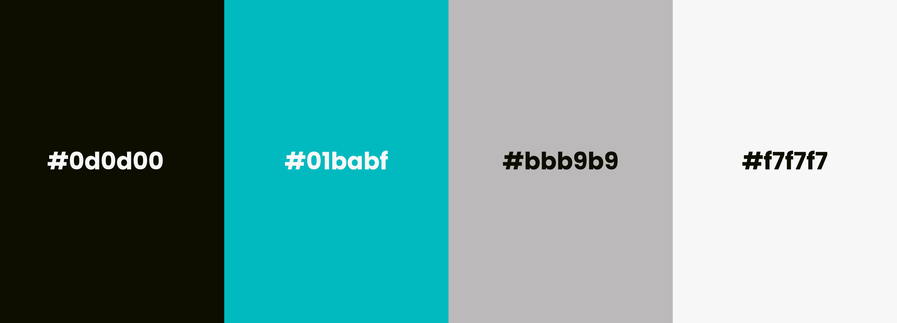

Cores principais:
- **Preto esverdeado (#0d0d00)** — sobriedade, foco e contraste  
- **Ciano (#01babf)** — tecnologia, inovação e destaque funcional  
- **Cinza médio (#bbb9b9)** — neutralidade e equilíbrio visual  
- **Cinza claro (#f7f7f7)** — leveza e conforto visual  

A paleta foi pensada para garantir **acessibilidade**, bom contraste e uma experiência visual confortável em longos períodos de uso.

---

## `🔤 Identidade Visual`

A identidade visual prioriza legibilidade e impacto institucional:

- **Logotipo tipográfico forte**, com formas robustas e espaçamento equilibrado  
- **Símbolo minimalista**, associado ao conceito de observação e conhecimento  
- **Uso estratégico da cor de destaque**, direcionando a atenção do usuário  
- **Interface limpa**, com poucos elementos decorativos e foco funcional  

O resultado é uma identidade sólida, coerente e adequada ao contexto educacional.

---

## `🛠️ Processo Criativo`

O desenvolvimento do design seguiu as seguintes etapas:

1. Análise do contexto educacional e do ambiente da biblioteca  
2. Definição do conceito visual e tom institucional  
3. Criação da identidade visual (logo, cores e estilo)  
4. Estruturação dos layouts das telas  
5. Ajustes de usabilidade e consistência visual  

Todo o processo foi orientado pela aplicação prática do sistema.

---

## `🖼️ Logotipo Principal`

---

## `🎭 Variações da Marca`

Aplicações do logotipo em diferentes fundos para garantir versatilidade e reconhecimento visual.

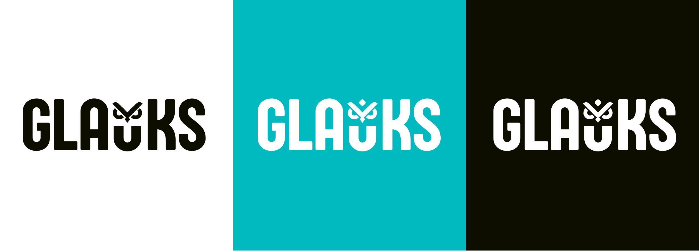

---

## 📱 `Telas Principais - MOBILE`

| Login | Cadastro | Início (Home) | Busca/Catálogo |
| :---: | :---: | :---: | :---: |
| 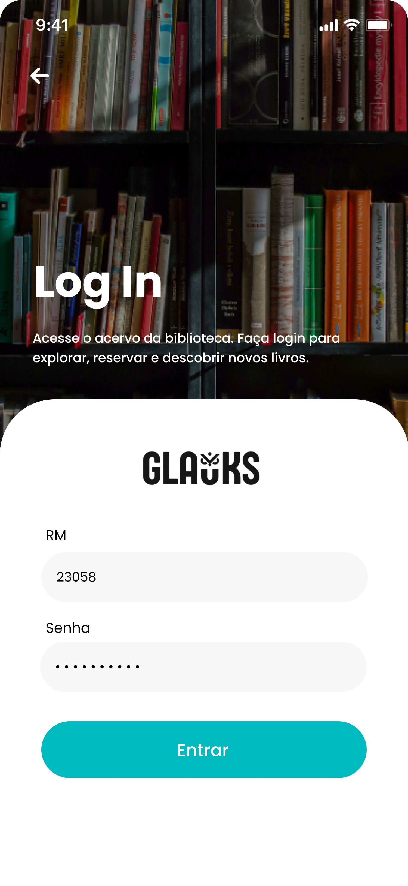 | 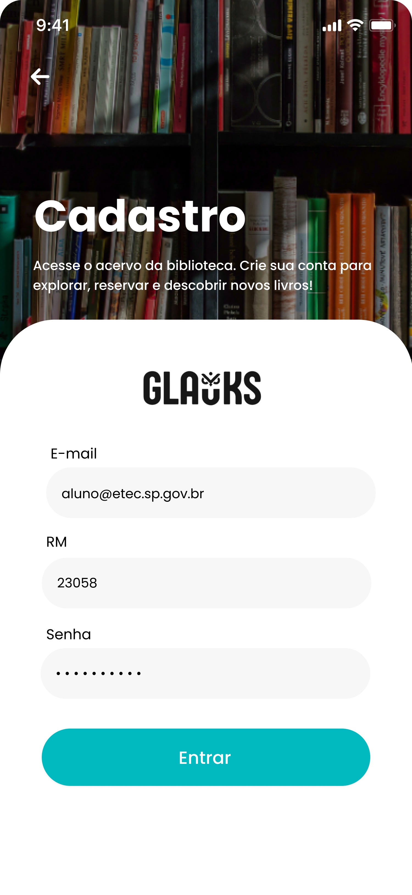 | 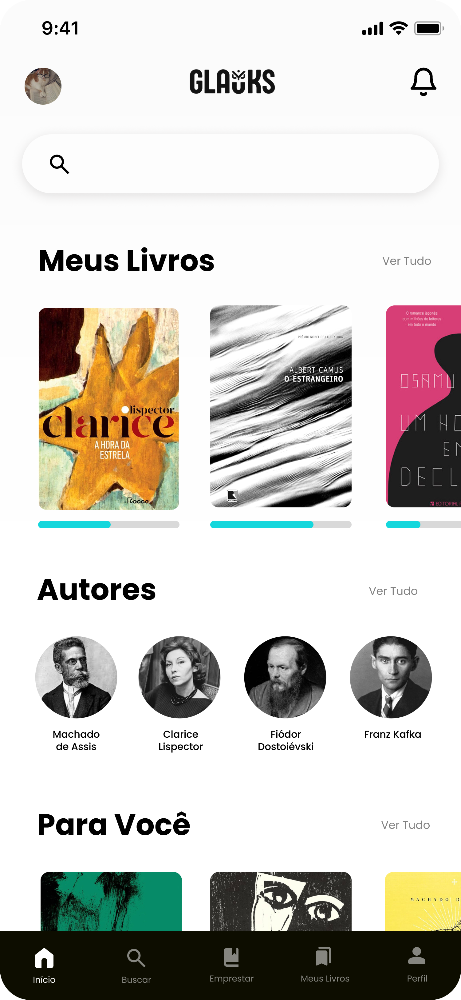 | 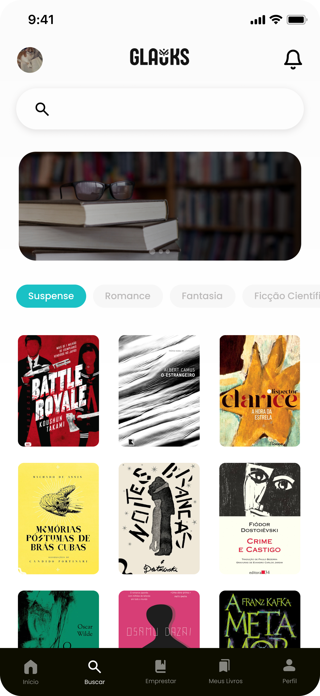 |

| Detalhes do Livro | Meus Empréstimos | Meus Livros (Lendo) | Perfil do Usuário |
| :---: | :---: | :---: | :---: |
|  | 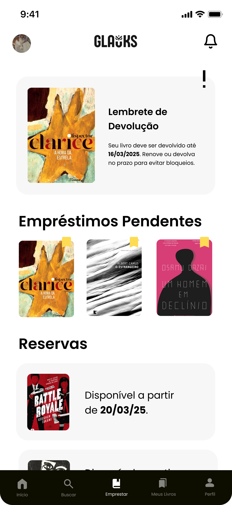 | 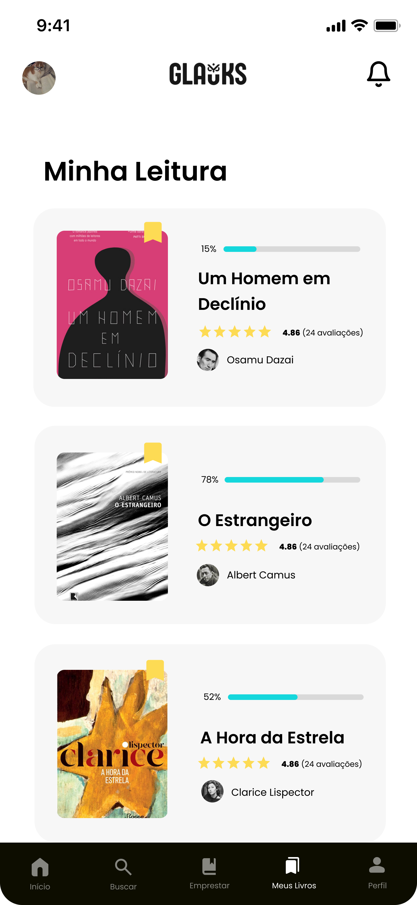 | 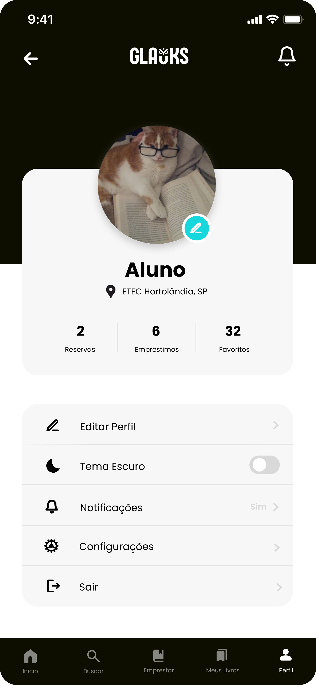 |

---
## 💻 `Telas Principais - WEB`

| Tela de Login | Tela de Cadastro |
| :---: | :---: |
| 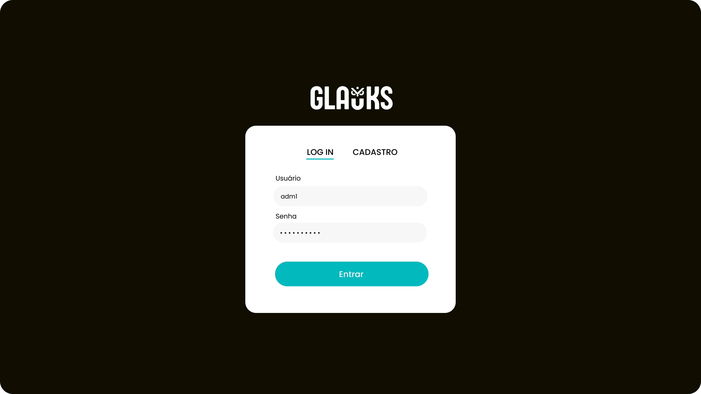 | 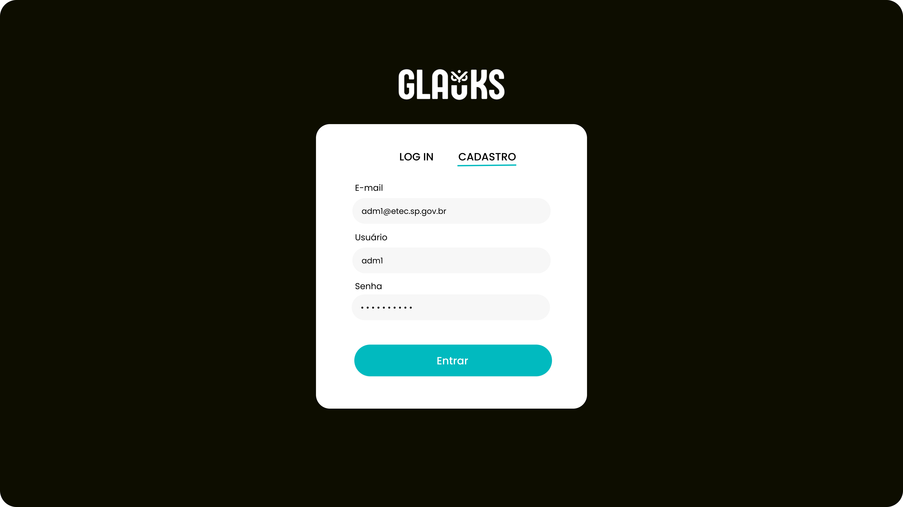 | 

| Adicionar Livro | Catálogo |
| :---: | :---: |
| 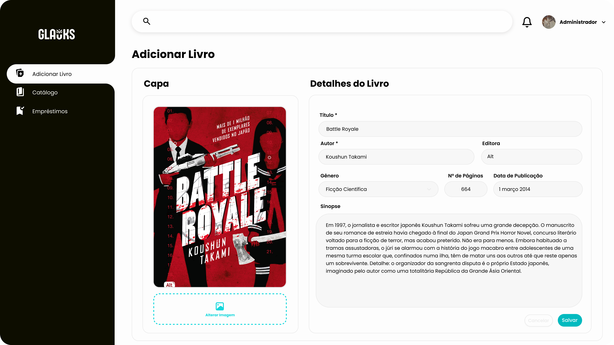 |  | 

| Reservas e Empréstimos |
| :---: |
| 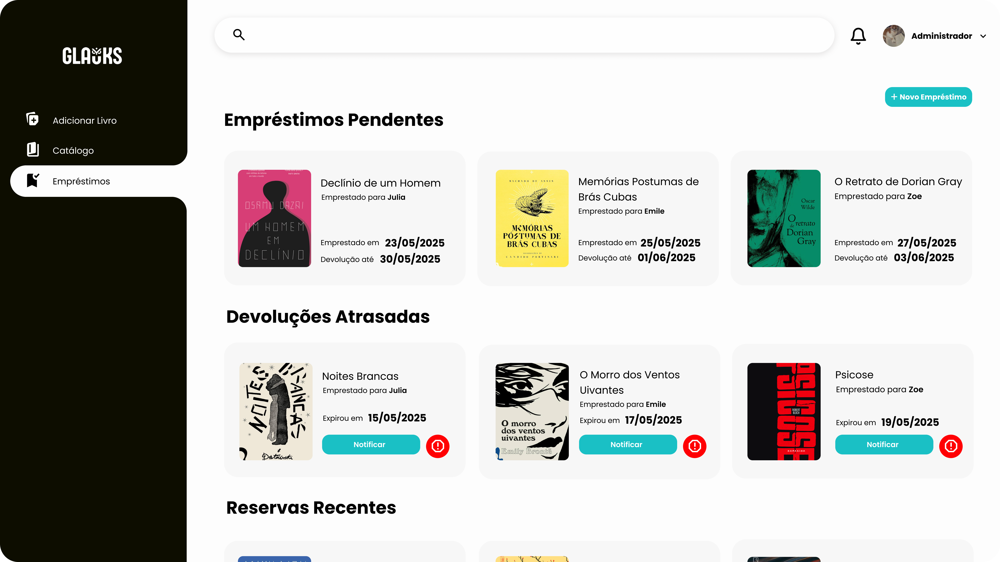 |

---

## `📦 Mockups e Aplicações`

Exemplos de aplicação da identidade visual em diferentes contextos e materiais.

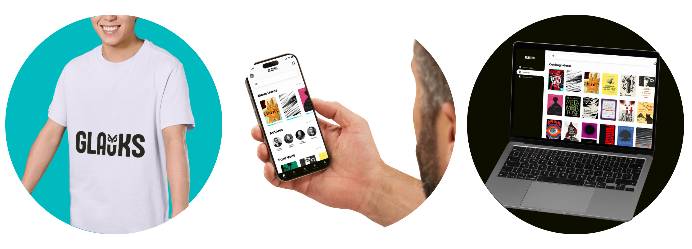

---

## `👤 Autoria`

Identidade visual desenvolvida por **Julia Franco**  
Designer Digital  
Projeto com fins acadêmicos - Trabalho de Conclusão de Curso (ETEC de Hortolândia)

