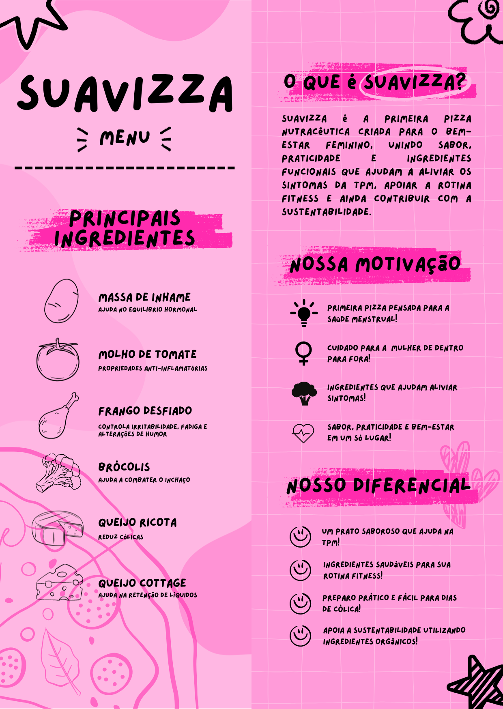

# 🍕 Suavizza — Branding & Design

**Suavizza** é um projeto de **branding e design visual** desenvolvido para o desafio **#PizzaImpossível**, do curso **Escola de Inovadores 2025**, promovido pelo **Centro Paula Souza (CPS)**.

O projeto foi **finalista do desafio** e teve como foco a criação de uma identidade visual forte, acessível e empática para uma proposta de pizza do futuro.

---

## 🎨 Conceito de Marca

A identidade da **Suavizza** foi construída a partir de uma linguagem visual leve, acolhedora e informativa, dialogando diretamente com o bem-estar feminino.

O branding parte da ideia de:
- Cuidado  
- Conforto  
- Saúde  
- Empatia  

A comunicação busca traduzir temas sensíveis de forma visualmente amigável, sem perder clareza ou impacto.

---

## 🖋️ Naming & Linguagem

O nome **Suavizza** surge da fusão entre:
- **“Suave”**, remetendo a conforto e alívio  
- **“Pizza”**, símbolo de praticidade e popularidade  

A linguagem verbal e visual da marca prioriza proximidade, simplicidade e identificação com o público-alvo.

---

## 🎨 Identidade Visual

A identidade visual foi pensada para ser:
- Didática  
- Ilustrativa  
- Jovem  
- Visualmente consistente  

Principais escolhas visuais:
- **Paleta em tons de rosa**, associada ao cuidado, acolhimento e feminilidade  
- **Tipografia manual/expressiva**, reforçando proximidade e informalidade  
- **Ilustrações autorais**, com traços orgânicos e linguagem lúdica  
- **Elementos gráficos repetíveis**, criando unidade visual entre os materiais  

---

## 🛠️ Processo Criativo

O desenvolvimento visual seguiu etapas focadas em branding:

1. Definição do público e tom de voz  
2. Pesquisa estética e referências visuais  
3. Construção da paleta, tipografia e elementos gráficos  
4. Criação das ilustrações e composições  
5. Aplicação da identidade em diferentes formatos  

---

## 🖼️ Aplicações da Marca

Os materiais abaixo demonstram a aplicação da identidade visual em diferentes contextos de comunicação.

### 📱 Carrossel para Instagram
Postagem desenvolvida para redes sociais, explorando narrativa visual, hierarquia de informação e consistência estética.

  

---

### 📰 Panfleto Impresso
Material gráfico criado para apresentação presencial, sintetizando o conceito da marca e seus diferenciais visuais.

  

---

### 📊 Slides de Apresentação
Slides contextuais desenvolvidos para reforçar a narrativa visual da marca durante a apresentação do projeto.

---

## 🏆 Destaque

✔ Projeto **finalista** do desafio #PizzaImpossível  
✔ Curso **Escola de Inovadores 2025** — **Centro Paula Souza (CPS)**  

---

## 👤 Autoria

Branding, identidade visual e materiais gráficos desenvolvidos por **Julia Franco**
