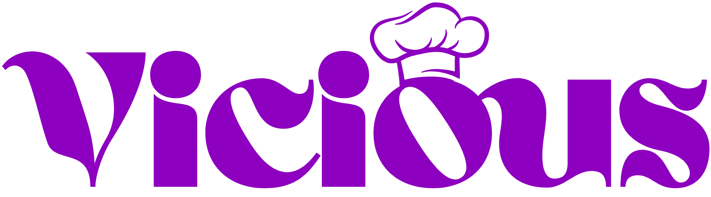
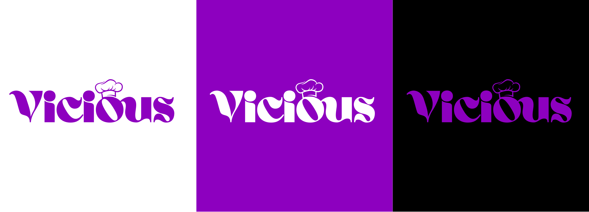
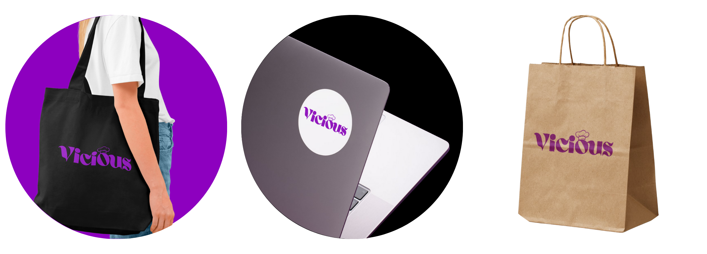

# `🍬 Vicious - Identidade Visual`

> A **Vicious** é uma marca de doces com uma proposta visual ousada e provocativa, criada para romper com o imaginário tradicionalmente infantil do segmento. Sua identidade visual aposta no contraste entre o conceito de “doçura” e uma estética intensa, moderna e marcante.

---

## `💡 Conceito da Marca`

A identidade da Vicious foi construída a partir da ideia de **quebra de expectativa**.  Enquanto o universo dos doces costuma ser associado a algo delicado e infantil, a marca adota uma linguagem visual intensa, moderna e impactante.

A marca se posiciona como:
- Ousada  
- Contemporânea  
- Memorável  

Essa dualidade entre o nome “Vicious” e o universo dos doces cria uma identidade provocativa, pensada para se destacar visualmente e conceitualmente.

---

## `🖋️ Origem do Nome`

O nome **Vicious** foi escolhido por seu significado forte e provocativo (“cruel”, “feroz”), criando um contraste direto com o segmento alimentício.  A intenção é despertar curiosidade e reforçar o posicionamento ousado da marca, tornando-a facilmente reconhecível.

---

## `🎨 Origem e Significado da Cor`

O **roxo** foi definido como cor principal da identidade por representar:

- Criatividade e originalidade  
- Intensidade e mistério  
- Diferenciação e sofisticação  

A escolha cromática foge dos padrões tradicionais do mercado de doces, reforçando a proposta contemporânea e autêntica da Vicious.

---

## `🔤 Identidade Visual`

A identidade visual foi construída para ser impactante e versátil, mantendo consistência em diferentes aplicações.

Elementos principais:
- **Logotipo tipográfico** com formas orgânicas e personalidade forte  
- **Símbolo complementar** (chapéu de confeiteiro), conectando visualmente a marca ao universo da confeitaria  
- **Paleta de cores contrastante**, garantindo boa legibilidade em fundos claros e escuros  
- **Aplicações flexíveis**, adaptáveis a produtos físicos e digitais  

---

## `🛠️ Processo Criativo`

O desenvolvimento da identidade visual seguiu as seguintes etapas:

1. Pesquisa de referências visuais e análise de marcas do segmento  
2. Definição do conceito e posicionamento da marca  
3. Criação do logotipo e variações  
4. Escolha da paleta cromática e tipografia  
5. Aplicação da identidade em mockups e materiais visuais  

Cada decisão foi pensada para reforçar a personalidade intensa e única da marca.

---

## `🖼️ Logotipo`

---

## `🎭 Variações da Marca`

Aplicações do logotipo em diferentes fundos para garantir versatilidade e reconhecimento visual.

---

## `📦 Mockups e Aplicações`

Exemplos de aplicação da identidade visual em diferentes contextos e materiais.

---

## `🛠️ Processo Criativo`

O processo de criação seguiu etapas estratégicas de branding:

1. Briefing com o cliente e entendimento da proposta da marca  
2. Pesquisa de referências visuais e análise de concorrentes  
3. Definição do conceito e posicionamento  
4. Desenvolvimento do logotipo e variações  
5. Criação das aplicações e mockups  

Todas as decisões visuais foram alinhadas aos objetivos e à personalidade da marca.

---

## `👤 Autoria`

Identidade visual desenvolvida por **Julia Franco**  
Designer Digital  
Projeto comercial — desenvolvido sob encomenda
